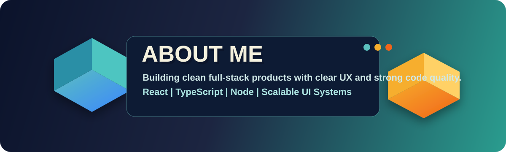

#  Hello, I'm Shukra Mohammed

  

  
  
  

  

---

## About Me

  

I build production-ready digital products that balance usability, performance, and maintainability.

- I design and ship full-stack applications with modern web technologies.
- I care deeply about reusable architecture, clean code, and long-term velocity.
- I enjoy working with teams that value ownership, collaboration, and execution.

---

## What I Focus On

| Area | Highlights |
|---|---|
| Product Engineering | End-to-end web products with React, TypeScript, Node.js, and strong DX. |
| Frontend Architecture | Component systems, scalable state patterns, and accessibility-first interfaces. |
| Quality and Delivery | Testing workflows, CI automation, and predictable release practices. |

---

## Connect With Me

  
  
  
  
  

---

## Tech Stack

### Frontend

  

### Backend and Database

  

### Tools and Platforms

  

---

## GitHub Insights

  

  

  
  

  

---

## Philosophy

> "Any fool can write code that a computer can understand. Good programmers write code that humans can understand."
>
> Martin Fowler

---

  <strong>Thanks for visiting my profile.</strong> 
  Building reliable products with clean, scalable engineering.

